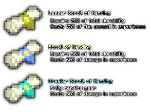

# Scrolls of Mending
## Introduction
Scrolls of Mending adds different ranks of mending scrolls, which repair your armor at the cost of experience. There are different ranks of scrolls, repairing different percentages of armor, and the experience cost changes dynamically depending on how much damage your gear has.

This is not compatible with any plugin/mod/datapack that unlocks all recipes - this datapack uses that system for crafting.

## Crafting
You first need to craft a blank parchment. This can be done by arranging paper in a 2x2 pattern on a crafting table.

Then, depending on the rank of scroll, you need to create a scroll seal. Surround one of the below materials in 8 gold nuggets at a crafting table:

- **Gold Ingot:** Lesser Scroll Seal
- **Lapis Lazuli:** Scroll Seal
- **Diamond:** Greater Scroll Seal

Then, toss a blank parchment, a seal, and an Enchanted Book with mending on the ground to craft a scroll.

## Usage
Right clicking the scroll in either your offhand or mainhand repairs your equipped gear (including a held tool that isn't the scroll itself) and consumes the scroll. The amount repaired and experience cost depends on the scroll type:

If you don't have enough experience levels, a message will appear:

## Installing
Open the latest version in the releases tab on the right. Download the resource pack and place it in your `resourcepacks` folder, then download the datapack and place it in the `datapacks` folder of your world or server.

To uninstall the datapack, run this command: `/function joshmats:scrollsofmending/uninstall`

Afterwards, you can safely disable then remove the datapack.

## Links
[Planet Minecraft](https://www.planetminecraft.com/data-pack/scrolls-of-mending-repair-consumables/)

## Credits
Sprites are made by [Bonii](https://twitter.com/ChalkDev)