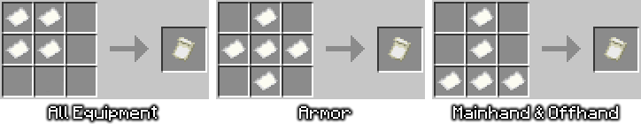

# Scrolls of Mending
## Introduction
Scrolls of Mending adds scrolls which repair your armor at the cost of experience. There are different ranks of scrolls that repair different percentages of durability, and the experience cost changes dynamically depending on how much total durability your gear has.

## Crafting
You first need to craft a blank parchment. This can be done by arranging paper on a crafting table depending on which equipment you want repaired.

Then, depending on the rank of scroll, you need to create a scroll seal. Surround one of the below materials in 8 gold nuggets at a crafting table:

- **Iron Nugget:** Lesser Scroll Seal
- **Lapis Lazuli:** Scroll Seal
- **Diamond:** Greater Scroll Seal

Then, toss a blank parchment, a seal, and an Enchanted Book with mending on the ground to craft a scroll.

## Usage
Right clicking the scroll repairs your equipped gear (including a held tool that isn't the scroll itself) and consumes the scroll. The amount repaired and experience cost depends on the scroll type:

 
(undamaged equipment is ignored in the cost calculation)

If you don't have enough experience levels, a message will appear:

## Installing
Open the latest version in the releases tab on the right. Download the resource pack and place it in your `resourcepacks` folder, then download the datapack and place it in the `datapacks` folder of your world or server.

If you want to easily merge datapacks and resourcepacks together, you can use [weld](https://weld.smithed.dev/) 
(some packs may not be compatible with others, but Scrolls of Mending follows Smithed's conventions for better compatibility with other packs)

To uninstall the datapack, run this command: `/function jmsm:uninstall`

Afterwards, you can safely disable then remove the datapack.

## Configuration
To open the config menu, run this command: `/function jmsm:config`
 

Config Options

- scroll use cooldown (in seconds, with actual cooldown up to 1 second early)
- cost calculation type
    - `default` bases cost on total durability, in line with the repair always being a % of full durability
    - `legacy` is the old system, basing only on damage
- experience cost of scrolls (in %, and based on cost calculation type)

    

## Links
[Planet Minecraft](https://www.planetminecraft.com/data-pack/scrolls-of-mending-repair-consumables/)

[Modrinth](https://modrinth.com/datapack/scrolls-of-mending)

## Credits
Sprites are made by [Bonii](https://twitter.com/ChalkDev)

## Contributing
If you want to help with translations, submit a pull request, message me on PlanetMinecraft, or hit me up on discord: joshmats
- You can base off of the US English file [here](src/assets/jmsm/lang/en_us.json)